# PyChat

PyChat is a Django + Channels real-time messaging application designed for direct conversations, group chats, profile management, and admin-controlled API access. It is built to help users communicate quickly in a polished web interface while also exposing a secure REST API for admin workflows.

> Live Demo: https://pychat-knm3.onrender.com

## 1. Project Overview

PyChat combines a full-featured chat experience with a production-ready deployment setup on Render. The project includes:

- real-time chat rooms and direct messaging
- profile, settings, and friends management
- attachment uploads and conversation history
- an admin-focused REST API with Token Auth and JWT
- WhiteNoise static file serving for deployment

This project is intended for developers, instructors, and reviewers who need a complete Django chat app with working deployment and testable API behavior.

## 2. Features Implemented

### Web Application Features
- User registration, login, logout, and protected access to chat features
- Profile page and settings page with account customization
- Friends and find-friends workflows
- Direct conversation creation and group conversation creation
- Conversation listing with latest activity ordering
- Unread, favorite, and group conversation filters
- Real-time chat via Django Channels WebSockets
- Message persistence and chat history
- Attachment upload support for conversations
- Admin navigation and admin UI styling
- WhiteNoise static file serving for production deployment

### API / Admin Features
- Admin-only user management API under `/api/`
- Token authentication endpoint for simple API access
- JWT authentication for modern token-based auth
- Current-user endpoint for admin session validation
- Postman/REST collection included for API testing

## 3. Tech Stack

- Python 3.14 / Django 6.0.5
- Django Channels 4.3.2 for real-time WebSockets
- Django REST Framework 3.16.0
- djangorestframework-simplejwt for JWT
- PostgreSQL on Render
- WhiteNoise for static files in production
- Gunicorn for WSGI serving
- Pillow for profile/avatar support
- dj-database-url and python-decouple for environment-based configuration

## 4. Project Structure

- `PyChat/` — Django project settings, ASGI/WSGI entry points, and main URL routing
- `accounts/` — registration, login, profile, and settings views
- `chat/` — conversation models, consumers, templates, and WebSocket routing
- `screenshots/` — UI and API testing screenshots
- `data.json` — fixture data for Render/PostgreSQL import
- `requirements.txt` — production dependencies
- `api_docs.md` — API overview and endpoint notes

## 5. API Documentation

The project exposes the following API endpoints under `/api/`:

| Method | Endpoint | Auth | Description | Example response |
|---|---|---|---|---|
| POST | `/api/token-auth/` | Public | Obtain a Token auth token | `{ "token": "..." }` |
| POST | `/api/token/` | Public | Obtain JWT access/refresh tokens | `{ "access": "...", "refresh": "..." }` |
| POST | `/api/token/refresh/` | Public | Refresh JWT token | `{ "access": "..." }` |
| GET | `/api/accounts/` | Admin required | List users | `[ { "id": 1, "username": "admin", "email": "..." } ]` |
| POST | `/api/accounts/` | Admin required | Create a user | `{ "id": 2, "username": "newuser", "email": "..." }` |
| GET | `/api/accounts/<username>/` | Admin required | Retrieve a user | `{ "id": 2, "username": "newuser", "email": "..." }` |
| PUT/PATCH | `/api/accounts/<username>/` | Admin required | Update a user | Updated user JSON |
| DELETE | `/api/accounts/<username>/` | Admin required | Delete a user | `204 No Content` |
| GET | `/api/accounts/me/` | Admin required | Return current authenticated admin | Current admin profile JSON |

## 6. Local Setup Instructions

1. Clone the repository
   ```bash
   git clone https://github.com/uncleuc/dune-cohort-final-project.git
   cd dune-cohort-final-project/PyChat
   ```

2. Create and activate a Python virtual environment
   ```bash
   python -m venv .venv
   .\.venv\Scripts\activate
   ```
   On macOS/Linux use:
   ```bash
   source .venv/bin/activate
   ```

3. Install dependencies
   ```bash
   pip install -r requirements.txt
   ```

4. Create your environment file
   ```bash
   copy .env.example .env
   ```
   Then update the values for your local machine.

5. Apply database migrations
   ```bash
   python manage.py migrate
   ```

6. Create an admin user
   ```bash
   python manage.py createsuperuser
   ```

7. Load fixture data (optional but recommended)
   ```bash
   python manage.py loaddata data.json
   ```

8. Run the development server
   ```bash
   python manage.py runserver
   ```

9. Open the app in your browser
   - Main site: http://127.0.0.1:8000/
   - Admin: http://127.0.0.1:8000/admin/

## 7. Environment Variables

A sample file is included at `.env.example` in the project root. Copy it to `.env` before running the app.

| Variable | Required | Purpose |
|---|---|---|
| `SECRET_KEY` | Yes | Django secret key used for session signing and CSRF protection |
| `DEBUG` | Yes | Enables debug mode locally (`True`) and disables it in production |
| `DATABASE_URL` | No | PostgreSQL or SQLite database connection string |
| `RENDER_EXTERNAL_HOSTNAME` | No | Render host name used for allowed hosts and trusted origins |
| `CSRF_TRUSTED_ORIGINS` | No | Extra origins allowed for CSRF validation |
| `REDIS_URL` | No | Optional future Redis configuration for production channels |

## 8. Screenshots

### Website Pages

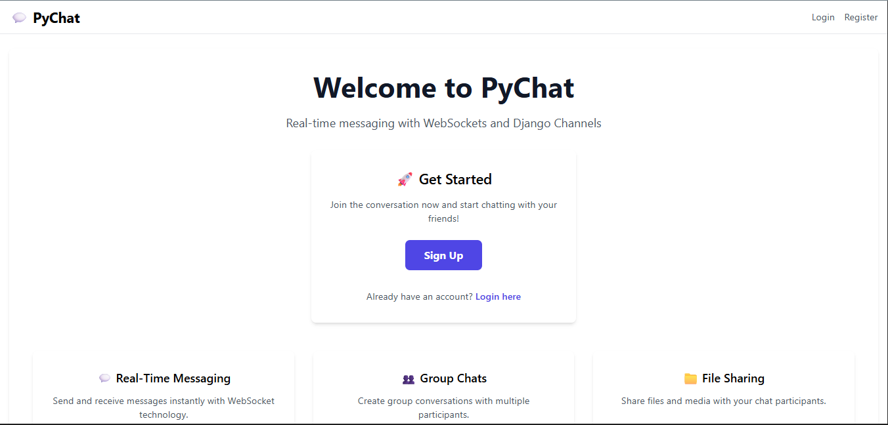
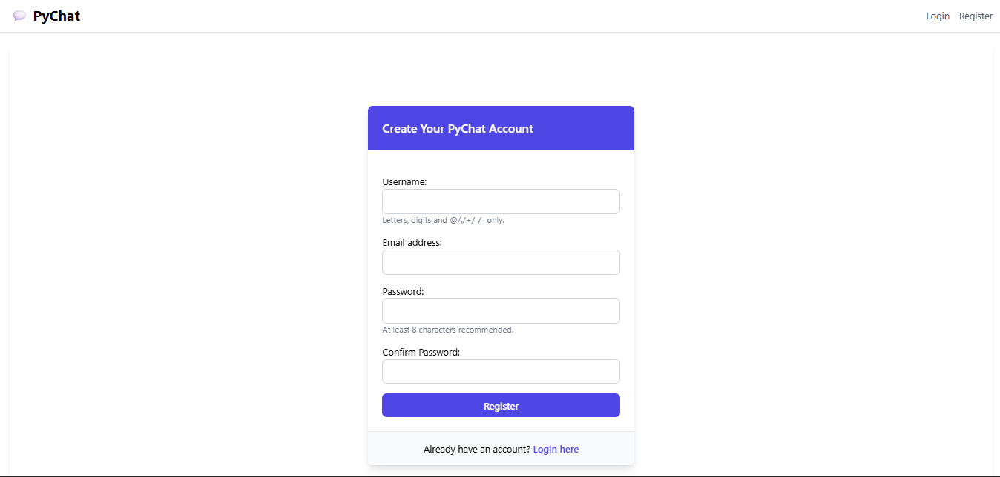
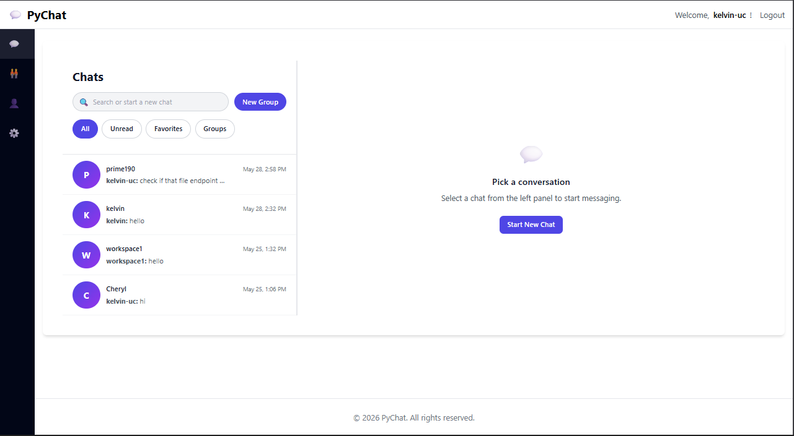
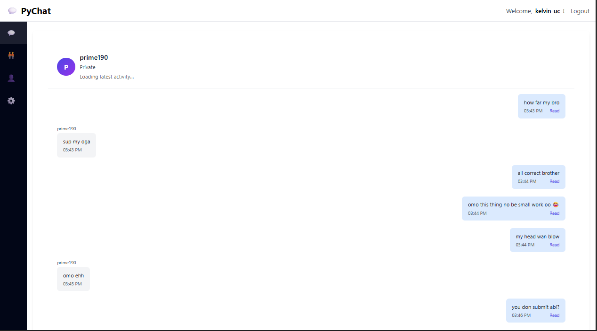
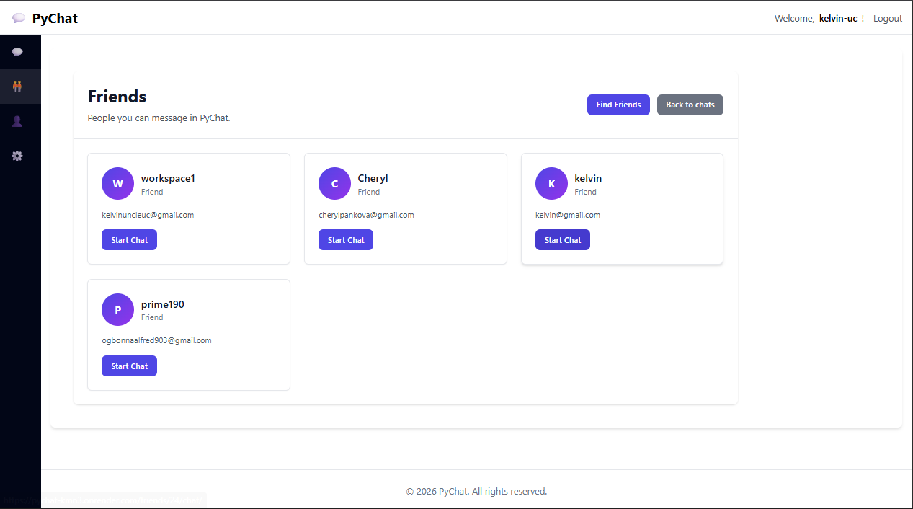
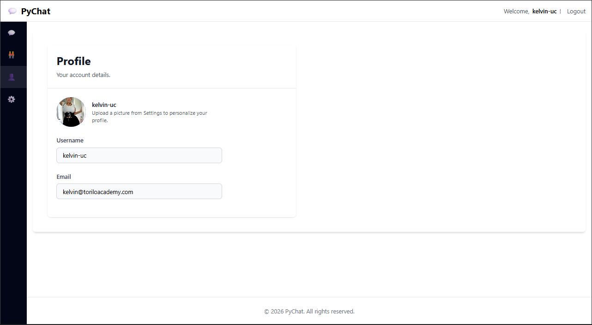
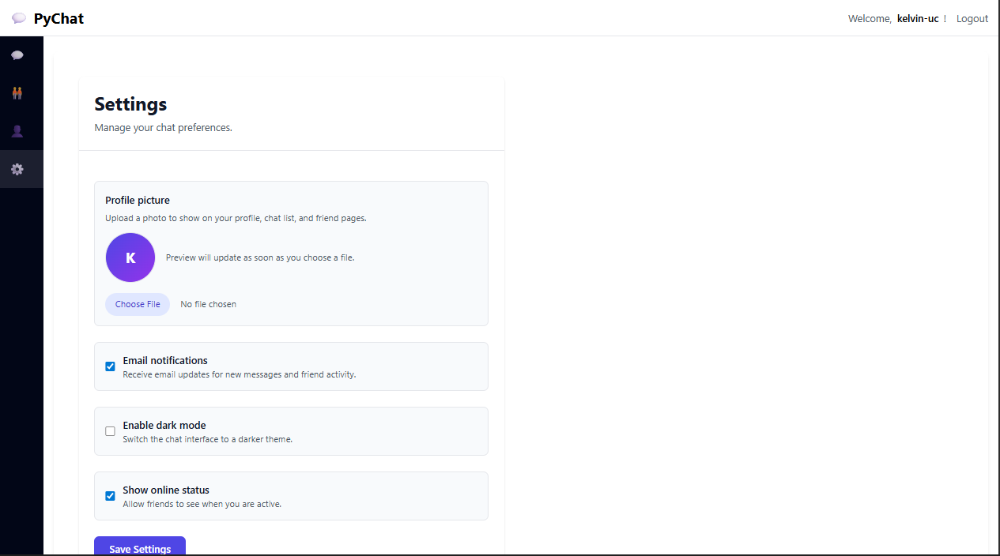
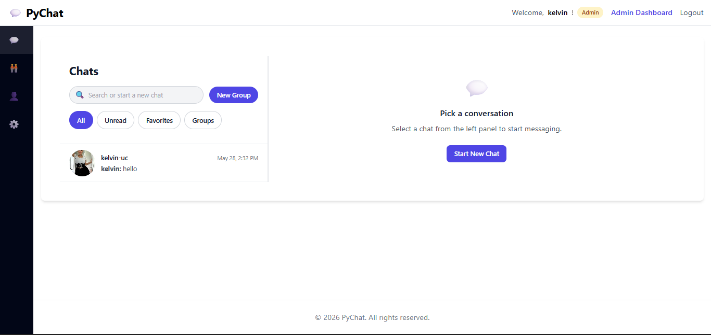

### API Testing Screenshots

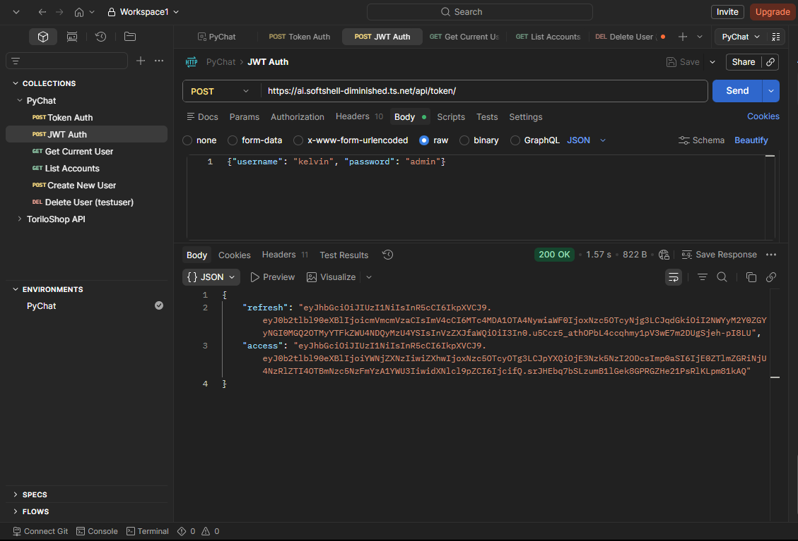
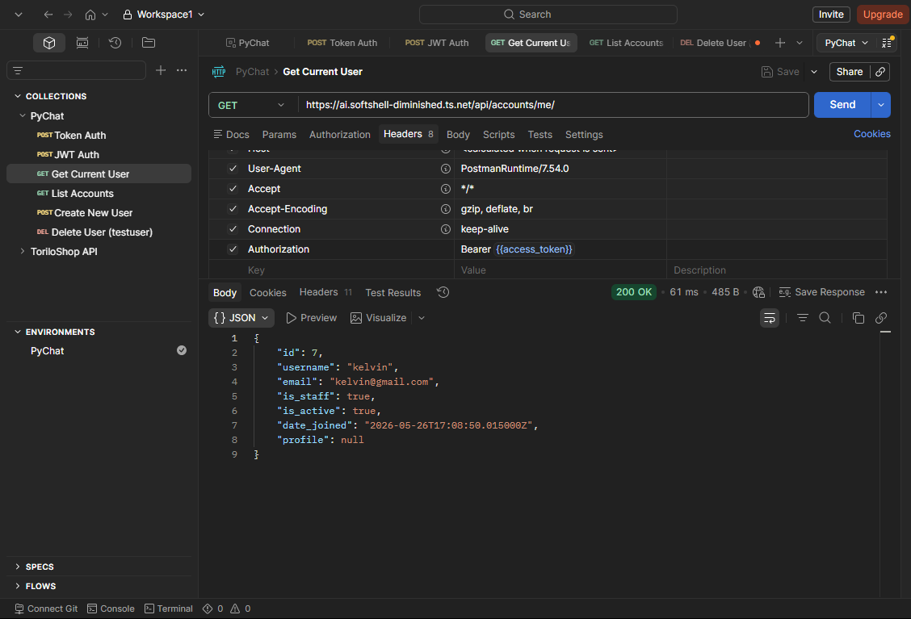
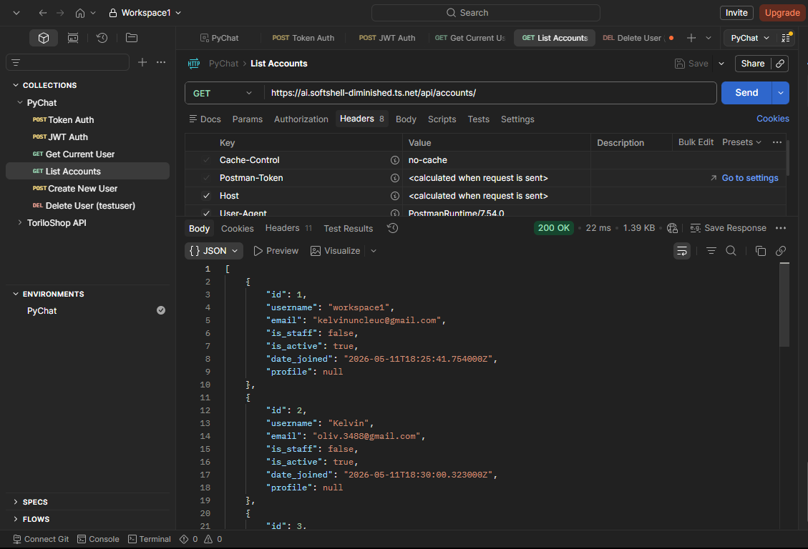
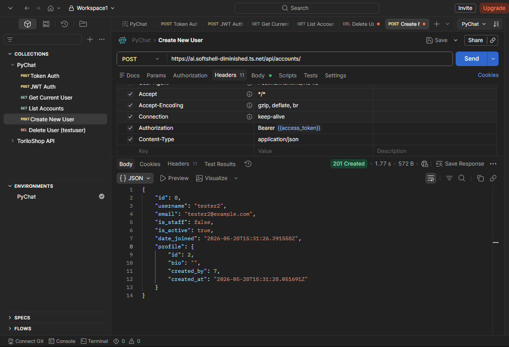
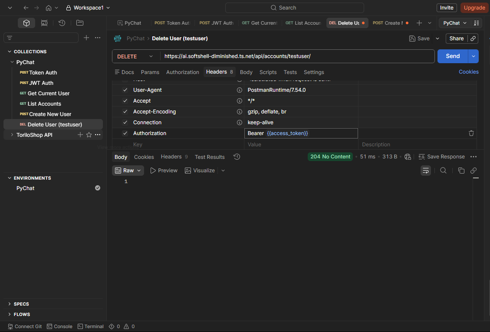

## 9. Future Improvements

- Add automated tests for views, models, consumers, and API workflows
- Add Redis-backed Channels for production multi-worker deployments
- Improve pagination and search/filtering for larger chat histories
- Add richer avatar upload and notification UX
- Expand API coverage with conversation and message management endpoints
- Voice and Video Call features using WebRTC and Django Channels
- Optimize database queries and add caching for conversation lists and message retrieval
- Robust Settings Features for more personalization and user control
- Add user presence indicators and typing notifications in the chat UI
- More Admin control directly from the website
- And much more!

## 10. Deployment Notes

The current deployment target is Render. The project uses:

- `gunicorn` for serving the Django app
- `whitenoise` for static files
- `psycopg2-binary` for PostgreSQL support
- `data.json` for fixture import during deployment

If you deploy on Render, ensure the build command runs:

```bash
pip install -r requirements.txt
python manage.py migrate
python manage.py loaddata data.json
python manage.py collectstatic --noinput
```
